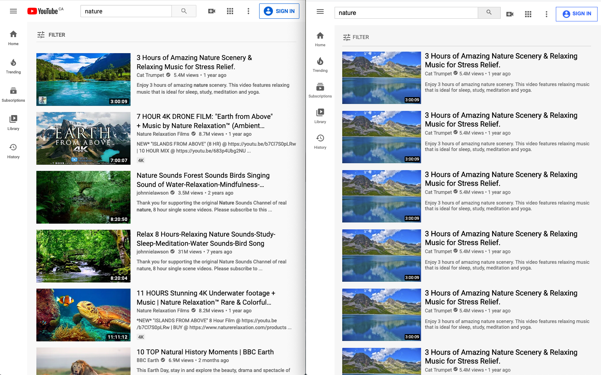

# WEB222 CSS Week 9 Walkthrough: Recreate YouTube's Search Results

In this [video walkthrough](https://youtu.be/Gi7IJ8n0m1Y) we use the CSS layout styling we learn in
[WEB222 Week 9](https://web222.ca/weeks/week09/) to make an HTML
document look like [the YouTube search results](https://www.youtube.com/results?search_query=nature).  NOTE: YouTube is likely to change it's page style,
so here is what it looked like at the time of writing:

- [YouTube Video Walkthrough](https://youtu.be/Gi7IJ8n0m1Y)
- [Final web page result](https://humphd.github.io/recreate-youtube-css/)

## Assets

To create this we use the following free assets and tools:

- https://unsplash.com/photos/3MLqSeVFP-Q
- https://google.github.io/material-design-icons
- https://fonts.google.com/specimen/Roboto?query=roboto
